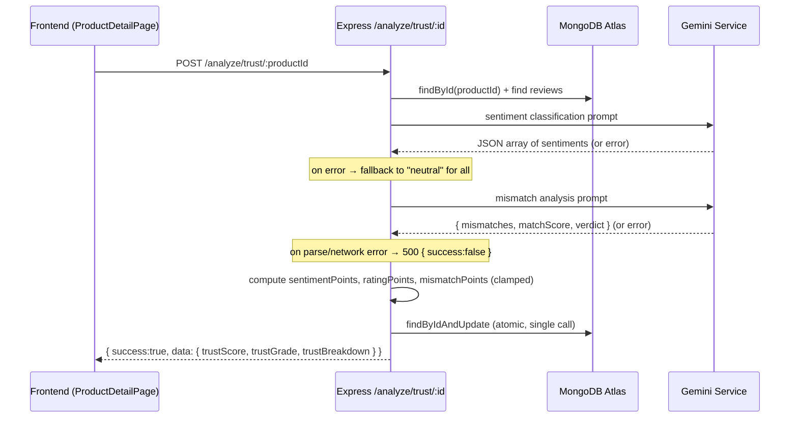

# Design Document — SachAI Trust Engine

## Overview

SachAI is an AI-powered product review trust scoring platform targeting Indian e-commerce consumers. The system is already functionally complete; this design covers the hardening work required to bring it to hackathon-ready production quality across four dimensions:

1. **Resilience** — graceful Gemini API failure handling so the app never crashes on AI errors
2. **UX polish** — frontend loading states, error handling, and mobile responsiveness
3. **Production readiness** — environment configuration, build pipeline, MongoDB Atlas, and deployment
4. **Correctness** — Trust Score boundary enforcement and atomic persistence

The Trust Score engine computes a 0–100 composite score from three weighted pillars:

| Pillar | Points | Source |
|---|---|---|
| Sentiment analysis | 0–40 | Gemini classifies each review as positive / neutral / negative |
| Rating quality | 0–30 | Average star rating normalised to 30 |
| Description match | 0–30 | Gemini compares product description vs review text; returns 0–100 matchScore |

Scores map to grades: A+ (≥85), A (≥75), B (≥65), C (≥50), D (≥35), F (<35).

---

## Architecture

```mermaid
graph TD
    Browser["Browser\n(React 19 + Vite)"]
    Vercel["Vercel\n(Static CDN)"]
    Render["Render\n(Node.js server)"]
    Atlas["MongoDB Atlas"]
    Gemini["Google Gemini 1.5 Flash\n(External API)"]

    Browser -->|HTTPS requests via Axios| Render
    Browser -->|Served from| Vercel
    Render -->|Mongoose ODM| Atlas
    Render -->|callGemini()| Gemini
```

### Request Flow — Trust Analysis



---

## Components and Interfaces

### Backend

#### `server/services/gemini.js` — `callGemini(prompt)`

**Current state:** Strips markdown fences, returns raw text.  
**Required changes:**
- Wrap the underlying SDK call in a `try/catch` that re-throws as a typed `GeminiError` carrying `{ type: 'network' | 'parse' | 'timeout', originalMessage }`.
- The 30-second timeout is already enforced by the Axios client on the frontend. On the backend, the `@google/generative-ai` SDK does not expose a native timeout; implement a `Promise.race` between the SDK call and a `setTimeout` rejection to abort at 30 s.

```
callGemini(prompt: string): Promise<string>
  throws GeminiError { type, message, cause }
```

#### `server/routes/analyze.js` — Trust route

**Key contract:**
```
POST /api/analyze/trust/:productId
→ 200 { success: true, data: { trustScore, trustGrade, trustBreakdown } }
→ 400 { success: false, message: "No reviews to analyze" }
→ 404 { success: false, message: "Product not found" }
→ 500 { success: false, message: "<human-readable error>" }
```

**Error branches:**
- Gemini network/HTTP error → catch, return 500 `{ success:false, message: err.message }`
- Gemini non-JSON response → catch `SyntaxError` from `JSON.parse`, return 500 `{ success:false, message: "AI response could not be parsed" }`
- Sentiment sub-step error → do not abort; fall back to `"neutral"` for all unclassified reviews and continue
- Any fatal error → do **not** call `findByIdAndUpdate`; existing product trust fields are preserved

#### `server/routes/analyze.js` — Scoring helpers (extractable pure functions)

These are currently inlined in the route handler. Extracting them as pure functions enables unit and property testing without standing up Express or MongoDB:

```js
computeSentimentPoints(reviews)   // → integer ∈ [0, 40]
computeRatingPoints(reviews)      // → integer ∈ [0, 30]
computeMismatchPoints(matchScore) // → integer ∈ [0, 30]
computeTrustGrade(trustScore)     // → "A+" | "A" | "B" | "C" | "D" | "F"
```

#### `server/index.js` — Startup validation

Add env-var checks before the Mongoose connect call:
```
if (!MONGODB_URI) → console.error + process.exit(1)
if (!GEMINI_API_KEY) → console.warn (non-fatal)
```

#### `GET /api/health`

Already implemented. Verified contract: `{ status: "ok", time: "<ISO 8601>" }`.

---

### Frontend

#### `client/src/api/index.js` — Axios interceptors

Add a response interceptor that:
1. On any non-2xx response: extracts `error.response.data.message` and calls `toast.error(message)`.
2. On network error (no `error.response`): calls `toast.error("Network error — please check your connection")`.

This provides the global error toast behaviour (Req 3.1, 3.2) without requiring each call site to duplicate the logic.

#### `client/src/pages/HomePage.jsx` — Skeleton loading

The skeleton grid is already rendered when `loading === true`. Verify at least 8 cards are rendered (currently `Array.from({ length: 8 })`). No structural change needed.

#### `client/src/pages/ProductDetailPage.jsx` — Loading & error state

| State | Current | Required |
|---|---|---|
| Product loading | `.skeleton-detail` with `aria-busy="true"` | Add visible `aria-label="Loading product"` text node (currently label is on the div, not exposed to screen readers as text) |
| Analysis in progress | Button text "Analyzing…" + disabled | ✅ Already implemented |
| Analysis failure | Toast via `catch` | Must NOT call `setProduct` on error path (already correct) |
| Product fetch failure | `toast.error` + `navigate("/")` | ✅ Already implemented |

#### `client/src/components/ReviewForm.jsx`

Submit button is already disabled while `submitting === true`. No structural change needed.

#### `client/src/App.jsx` — 404 route

Currently renders a bare `<h1>`. Replace with a styled `NotFoundPage` component consistent with the app's design system.

#### `client/vercel.json`

```json
{
  "rewrites": [{ "source": "/(.*)", "destination": "/index.html" }]
}
```

---

## Data Models

### Product (Mongoose — `server/models/Product.js`)

| Field | Type | Notes |
|---|---|---|
| `title` | String | required, max 200 |
| `description` | String | required, max 2000 |
| `category` | String (enum) | 13 valid values |
| `price` | Number | min 0 |
| `images` | [String] | URLs |
| `averageRating` | Number | 0–5, maintained by `syncProductStats` |
| `totalReviews` | Number | maintained by `syncProductStats` |
| `trustScore` | Number\|null | 0–100, integer |
| `trustGrade` | String\|null | `"A+" \| "A" \| "B" \| "C" \| "D" \| "F"` |
| `trustBreakdown` | Mixed\|null | see breakdown shape below |
| `lastAnalyzed` | Date\|null | |

**trustBreakdown shape:**
```json
{
  "sentimentPoints": 28,
  "ratingPoints": 24,
  "mismatchPoints": 22,
  "sentimentRatio": { "positive": 6, "negative": 2, "total": 10 },
  "averageRating": 3.8,
  "matchScore": 74,
  "mismatches": ["Material described as pure silk but reviews mention synthetic feel"],
  "verdict": "Mostly positive but description accuracy could be improved"
}
```

### Review (Mongoose — `server/models/Review.js`)

| Field | Type | Notes |
|---|---|---|
| `productId` | ObjectId | ref Product, indexed |
| `reviewerName` | String | default "Anonymous" |
| `rating` | Number | 1–5, required |
| `text` | String | required |
| `sentiment` | String\|null | `"positive" \| "neutral" \| "negative"` |
| `themes` | [String] | |
| `verified` | Boolean | default false |

### Trust Score Computation (pure logic layer)

```
sentimentScore_raw = ((positiveCount - negativeCount × 0.5) / totalCount) × 40
sentimentPoints    = clamp(round(sentimentScore_raw), 0, 40)

ratingPoints       = clamp(round((avgRating / 5) × 30), 0, 30)

matchScoreClamped  = clamp(matchScore, 0, 100)           ← clamp raw Gemini value first
mismatchPoints     = clamp(round((matchScoreClamped / 100) × 30), 0, 30)

trustScore         = sentimentPoints + ratingPoints + mismatchPoints   ← inherently 0–100
```

Since each sub-score is individually clamped and non-negative, `trustScore ∈ [0, 100]` is guaranteed without a final clamp on the sum.

---

## Correctness Properties

*A property is a characteristic or behavior that should hold true across all valid executions of a system — essentially, a formal statement about what the system should do. Properties serve as the bridge between human-readable specifications and machine-verifiable correctness guarantees.*

### Property 1: Gemini error always produces a structured failure response

*For any* error thrown by the Gemini service (network error, HTTP error, timeout), the trust analysis route SHALL return a response with `success === false` and a non-empty `message` string.

**Validates: Requirements 1.1**

---

### Property 2: Non-JSON Gemini response produces exact error message

*For any* string that is not valid JSON returned by the Gemini service, the trust analysis route SHALL return HTTP 500 with `success === false` and `message === "AI response could not be parsed"`.

**Validates: Requirements 1.2**

---

### Property 3: Trust data is preserved after failed analysis

*For any* product with pre-existing `trustScore`, `trustGrade`, and `trustBreakdown` values, when the trust analysis route fails due to a Gemini error, those three fields on the persisted product SHALL remain byte-for-byte identical to their pre-failure values.

**Validates: Requirements 1.4**

---

### Property 4: Neutral fallback for unclassified reviews on sentiment error

*For any* set of reviews with `sentiment === null`, when the Gemini sentiment classification call fails, all reviews in that set SHALL have their `sentiment` field set to `"neutral"` before the Trust Score is computed.

**Validates: Requirements 1.5**

---

### Property 5: API error toast displays the server's message

*For any* non-2xx Axios error response that contains a `data.message` string, the frontend toast notification SHALL display that exact `message` string to the user.

**Validates: Requirements 3.1**

---

### Property 6: Trust score display is preserved after failed analysis

*For any* rendered `ProductDetailPage` that is displaying a `trustScore` and `trustGrade`, when the `analyzeTrust` API call fails, the displayed `trustScore` and `trustGrade` SHALL be identical to their values before the failed call.

**Validates: Requirements 3.3**

---

### Property 7: Trust score is always a bounded integer with a valid grade

*For any* non-empty set of reviews with valid ratings (1–5) and any `matchScore` returned by Gemini (including out-of-range values), the computed `trustScore` SHALL be an integer in the closed range `[0, 100]`, and `trustGrade` SHALL be exactly one of `"A+"`, `"A"`, `"B"`, `"C"`, `"D"`, `"F"`.

**Validates: Requirements 10.1, 10.2**

---

### Property 8: All sub-scores are individually clamped within their maximum bounds

*For any* review set and any raw `matchScore` value (including negative values and values above 100), the computed sub-scores SHALL satisfy: `sentimentPoints ∈ [0, 40]`, `ratingPoints ∈ [0, 30]`, and `mismatchPoints ∈ [0, 30]`.

**Validates: Requirements 10.3, 10.4, 10.5, 10.6**

---

## Error Handling

### Backend Error Matrix

| Scenario | HTTP Status | Response Body |
|---|---|---|
| Gemini network/HTTP error | 500 | `{ success: false, message: err.message }` |
| Gemini returns non-JSON | 500 | `{ success: false, message: "AI response could not be parsed" }` |
| Gemini timeout (>30 s) | 500 | `{ success: false, message: "AI request timed out" }` |
| Sentiment sub-step fails | (non-fatal) | Fallback to `"neutral"`, analysis continues |
| No reviews for product | 400 | `{ success: false, message: "No reviews to analyze" }` |
| Product not found | 404 | `{ success: false, message: "Product not found" }` |
| Validation error | 400 | `{ success: false, errors: [ { path, msg } ] }` |
| Unknown route | 404 | `{ success: false, message: "Route not found" }` |
| Unhandled server error | 500 | `{ success: false, message: "Internal server error" }` |

### Frontend Error Handling Strategy

- **Global Axios interceptor** handles all non-2xx and network errors with a toast, reducing per-call boilerplate.
- **Per-call overrides** are allowed where a component needs custom recovery (e.g., `ProductDetailPage` navigates to `/` on product load failure).
- **Inline validation errors** on `AddProductPage` are rendered via the local `errors` state, not as toasts, because field-level context is more useful than a global notification.
- **Trust Score analysis failure** must NOT update the `product` state — the existing score stays visible.

### Startup Error Strategy

| Condition | Behaviour |
|---|---|
| `MONGODB_URI` missing | `console.error` + `process.exit(1)` |
| `GEMINI_API_KEY` missing | `console.warn` (server still starts; health endpoint responds) |
| MongoDB connection failure | `console.error` + `process.exit(1)` (Render's restart policy retries) |

---

## Testing Strategy

### PBT Applicability Assessment

This feature contains a mix of:
- **Pure computation logic** (`computeSentimentPoints`, `computeRatingPoints`, `computeMismatchPoints`, `computeTrustGrade`) — ideal for property-based testing
- **Route handler error behaviour** (Gemini failure paths) — testable with PBT using mocks
- **UI state behaviour** (loading states, toast messages) — suitable for example-based tests
- **Infrastructure/deployment** (env vars, MongoDB Atlas, Vercel) — smoke/integration tests only

Property-based testing IS applicable for Properties 1–8. The chosen library is **fast-check** (JavaScript), used in both backend (Node.js) and frontend (Vitest) test suites.

### Dual Testing Approach

#### Unit / Example-Based Tests

Focus on concrete scenarios and edge cases that property tests do not naturally cover:

- Skeleton loader renders ≥8 cards during `loading === true`
- `ProductDetailPage` shows `aria-busy="true"` during product fetch
- Analyze button is disabled and shows "Analyzing…" during in-flight request
- `ReviewForm` submit button is disabled while submitting
- Navigation to unknown route renders "Page Not Found"
- API client falls back to `http://localhost:5000/api` when `VITE_API_URL` is unset
- `GET /api/health` returns `{ status: "ok", time: string }`
- Backend exits with non-zero code when `MONGODB_URI` is missing
- Backend logs warning and continues when `GEMINI_API_KEY` is missing

#### Property-Based Tests (fast-check, minimum 100 iterations each)

Each property test is tagged with a comment referencing the design property for traceability.

```
// Feature: sachai-trust-engine, Property 1: Gemini error always produces a structured failure response
// Feature: sachai-trust-engine, Property 2: Non-JSON Gemini response produces exact error message
// Feature: sachai-trust-engine, Property 3: Trust data is preserved after failed analysis
// Feature: sachai-trust-engine, Property 4: Neutral fallback for unclassified reviews on sentiment error
// Feature: sachai-trust-engine, Property 5: API error toast displays the server's message
// Feature: sachai-trust-engine, Property 6: Trust score display is preserved after failed analysis
// Feature: sachai-trust-engine, Property 7: Trust score is always a bounded integer with a valid grade
// Feature: sachai-trust-engine, Property 8: All sub-scores are individually clamped within their maximum bounds
```

**Generator strategies:**

| Property | What fast-check generates |
|---|---|
| P1 | `fc.string()` as error message, error type enum |
| P2 | `fc.string()` filtered to exclude valid JSON (e.g., prefix with `!` or use non-JSON starters) |
| P3 | `fc.record({ trustScore: fc.integer(0,100), trustGrade: fc.constantFrom("A+","A","B","C","D","F"), trustBreakdown: fc.object() })` |
| P4 | `fc.array(fc.record({ _id: fc.string(), sentiment: fc.constant(null), text: fc.string() }))` |
| P5 | `fc.string({ minLength: 1 })` as the message field in a mocked Axios error |
| P6 | `fc.integer(0,100)` for trustScore, `fc.constantFrom(...)` for trustGrade |
| P7 | `fc.array(fc.record({ rating: fc.integer(1,5), sentiment: fc.constantFrom("positive","neutral","negative") }), { minLength: 1 })`, `fc.integer(-50, 150)` for matchScore |
| P8 | Same as P7; assert each sub-score independently |

#### Integration Tests

- MongoDB Atlas connection establishes successfully with a valid `MONGODB_URI`
- Seed script inserts exactly 5 products with 10 reviews each
- `POST /api/analyze/trust/:id` persists all four fields in a single `findByIdAndUpdate` call (inspect Mongoose query log)
- Deployed backend health endpoint responds at `GET /api/health`
- Deployed frontend serves the React app at root URL and correctly handles `/products/:id` on page refresh

#### Smoke Tests

- Backend starts successfully with all env vars set
- Backend exits with non-zero code when `MONGODB_URI` is absent
- Frontend `npm run build` completes with no errors
- Vercel deployment serves static assets from `client/dist/`

### Test Configuration Notes

- Backend tests: **Vitest** (ESM-compatible) with `vi.mock` for `callGemini` and Mongoose models
- Frontend tests: **Vitest** + **@testing-library/react** for component tests
- Property tests: `import fc from 'fast-check'` — use `fc.assert(fc.property(...))` with default 100 runs
- Do **not** make real Gemini API calls in property tests; always mock `callGemini`
