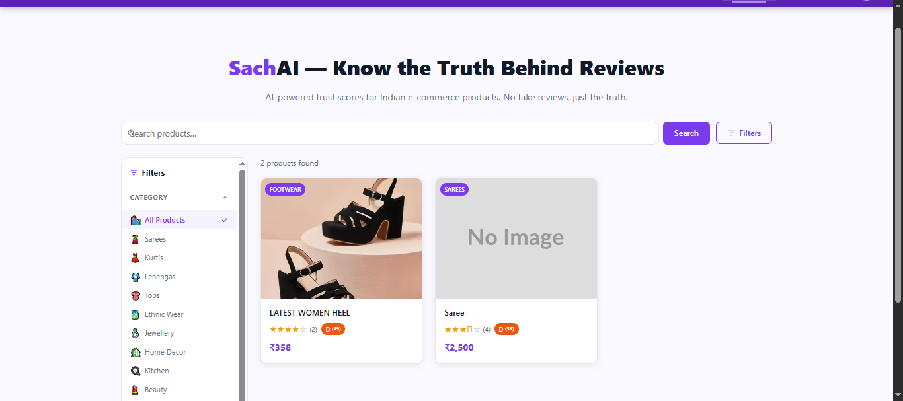
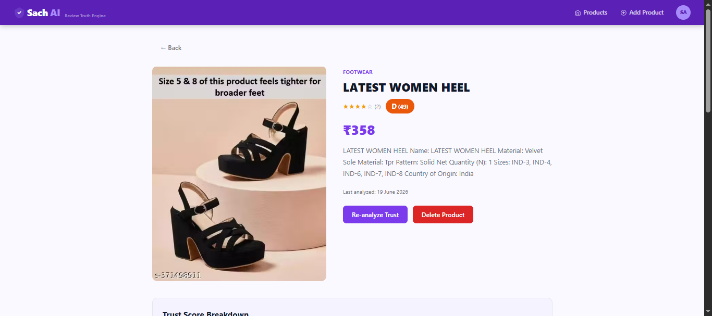
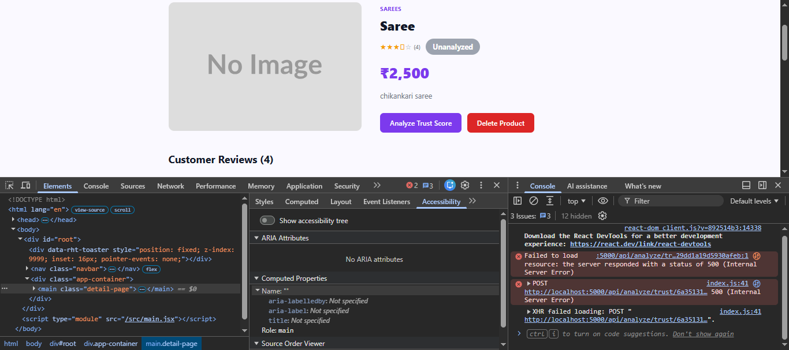

# SachAI — Review Truth Engine

> AI-powered trust scoring for Indian e-commerce. Built for hackathon demo.

Millions of shoppers on platforms like Meesho are misled by inflated ratings and fake reviews. SachAI solves this by using **Google Gemini 2.5 Flash** to analyse review sentiment, detect description-vs-review mismatches, and produce a transparent 0–100 **Trust Score** with an A+–F grade — so shoppers know exactly what they're buying.

---

## Tech Stack

| Layer | Tech |
|---|---|
| Backend | Node.js 22 + Express 4 (ESM) |
| Database | MongoDB + Mongoose |
| AI | Google Gemini 2.5 Flash (`@google/genai` v2) |
| Frontend | React 19 + Vite 8 + React Router 7 |
| Deployment | Render (backend) · Vercel (frontend) · MongoDB Atlas |

---

## Live Demo

| | URL |
|---|---|
| Frontend | https://meesho-sach-ai.vercel.app |
| Backend health-check | https://meeshosachai.onrender.com/api/health |

> The Render free tier spins down after inactivity — first request may take ~30 s.

---

## Screenshots

### Homepage — Product Grid with Sidebar Filters


### Product Detail — Trust Score Badge


### Trust Score Breakdown


---

## How It Works

1. **Browse products** — the homepage shows all products with category/sort filters in a collapsible sidebar.
2. **Trigger AI analysis** — click "Analyze Trust Score" on any product detail page.
3. **Gemini analyses the reviews** — sentiment classification, rating quality scoring, and description-vs-review mismatch detection run in sequence.
4. **Trust Score is displayed** — a 0–100 score with an A+–F grade and a full pillar-by-pillar breakdown is rendered instantly.

---

## Trust Score Formula

| Pillar | Max Points | How it's calculated |
|---|---|---|
| **Sentiment** | 40 | `((positive − negative × 0.5) / total) × 40`, clamped to [0, 40] |
| **Rating Quality** | 30 | `(avgRating / 5) × 30`, clamped to [0, 30] |
| **Description Match** | 30 | Gemini `matchScore` (0–100) scaled to 30, clamped to [0, 30] |

**Total = Sentiment + Rating Quality + Description Match** → always in [0, 100]

### Grading Scale

| Grade | Score |
|---|---|
| A+ | 85 – 100 |
| A | 75 – 84 |
| B | 65 – 74 |
| C | 50 – 64 |
| D | 35 – 49 |
| F | 0 – 34 |

---

## Local Development

### Prerequisites

- Node.js 20+
- MongoDB Atlas cluster (or local MongoDB)
- Gemini API key from [Google AI Studio](https://aistudio.google.com/apikey) (free, starts with `AIzaSy`)

### 1. Clone

```bash
git clone https://github.com/swasti31jain/MeeshoSachAI.git
cd MeeshoSachAI
```

### 2. Backend setup

```bash
cd server
cp .env.example .env
```

Edit `server/.env`:

```env
PORT=5000
MONGODB_URI=mongodb+srv://<user>:<password>@cluster.mongodb.net/sachai
GEMINI_API_KEY=AIzaSy...your-key-here
CLIENT_URL=http://localhost:5173
```

```bash
npm install
npm run seed      # loads 5 sample products with reviews
npm run dev       # http://localhost:5000
```

Verify: `curl http://localhost:5000/api/health`

### 3. Frontend setup

```bash
cd ../client
cp .env.example .env
# .env already set to http://localhost:5000/api — no changes needed for local dev
npm install
npm run dev       # http://localhost:5173
```

---

## API Reference

### Products
| Method | Path | Description |
|---|---|---|
| GET | `/api/products` | List (`?category`, `?search`, `?sort`, `?page`, `?limit`) |
| GET | `/api/products/:id` | Single product |
| POST | `/api/products` | Create |
| PUT | `/api/products/:id` | Update |
| DELETE | `/api/products/:id` | Delete + reviews |

### Reviews
| Method | Path | Description |
|---|---|---|
| GET | `/api/products/:id/reviews` | List reviews |
| POST | `/api/products/:id/reviews` | Submit review |
| DELETE | `/api/products/:id/reviews/:reviewId` | Delete review |

### Analysis
| Method | Path | Description |
|---|---|---|
| POST | `/api/analyze/trust/:productId` | **Full trust score** — sentiment + mismatch + rating |
| POST | `/api/analyze/sentiment/:productId` | Classify review sentiments only |
| POST | `/api/analyze/mismatch/:productId` | Description-vs-review mismatch only |

### Health
| Method | Path | Description |
|---|---|---|
| GET | `/api/health` | `{ status: "ok", time: "<ISO>" }` |

---

## Project Structure

```
SachAI/
├── server/
│   ├── models/         # Product.js, Review.js
│   ├── routes/         # products.js, reviews.js, analyze.js
│   ├── services/       # gemini.js, trustScore.js
│   ├── tests/          # Property-based tests (fast-check + Vitest)
│   ├── index.js
│   ├── seed.js
│   └── .env.example
└── client/
    ├── src/
    │   ├── api/        # Axios client with global error interceptor
    │   ├── components/ # Navbar, Sidebar, ProductCard, TrustBadge, TrustBreakdown…
    │   ├── pages/      # HomePage, ProductDetailPage, AddProductPage, NotFoundPage
    │   └── context/    # ProductContext
    ├── vercel.json     # SPA routing rewrite for Vercel
    └── .env.example
```

---

## Deployment

### Backend → Render

1. Push repo to GitHub
2. New **Web Service** → root directory: `server/`
3. Start command: `node index.js`
4. Environment variables: `MONGODB_URI`, `GEMINI_API_KEY`, `CLIENT_URL`, `PORT`
5. Health-check path: `/api/health`

### Frontend → Vercel

1. Import repo → root directory: `client/`
2. Add env var: `VITE_API_URL=https://your-render-backend.onrender.com/api`
3. `client/vercel.json` handles SPA routing automatically

---

## License

MIT
